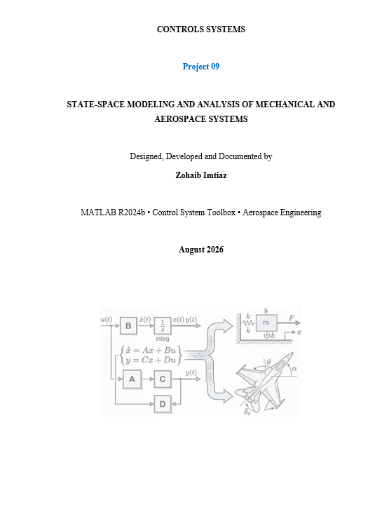

# State-Space Modeling and Analysis of Mechanical and Aerospace Systems

**Classical → Modern Control Systems | State-Space Representation | Controllability | Observability | MATLAB | Aerospace Engineering**

This repository contains my ninth independent control systems project — the transition point in the series from classical transfer-function control to modern state-space methods, built first on a mass–spring–damper system and then carried directly into the aircraft pitch-control plant studied in Projects 04–08.

---

## Engineering Question

> "Does the state-space representation of the aircraft pitch plant preserve the exact same dynamics as its transfer function — and is the system actually controllable and observable, so that modern control techniques can be applied to it at all?"

**Answer: Yes to both.** The state-space and transfer-function responses overlap exactly, and the aircraft model is fully controllable and fully observable — clearing the way for pole placement, LQR, and Kalman filtering in Projects 10–12.

---

## Overview

Every controller through Project 08 was designed from a transfer function — a description of input/output behavior with no visibility into the system's internal variables. Project 09 rebuilds the same aircraft dynamics using internal state variables instead, in two stages:

1. **Mass–spring–damper (2nd order)** — introduce state-space fundamentals: state definition, eigenvalues, parameter studies, controllability
2. **Aircraft pitch plant (3rd order)** — apply the same framework to the non-minimum-phase plant from Projects 04–08, and verify it against the known transfer function

---

## Stage 1 — Mass–Spring–Damper State-Space Model

**Governing equation:** `m·ẍ + b·ẋ + k·x = F`

**States:** `x₁ = x` (position), `x₂ = ẋ` (velocity)

For `m = b = k = 1`:

```
A = [0  1;  -1  -1]     B = [0; 1]     C = [1  0]     D = [0]
```

| Check | Result |
|---|---|
| Eigenvalues of A | −0.5 ± 0.866j |
| Poles of transfer function | −0.5 ± 0.866j |
| Step & impulse response (SS vs TF) | Overlap exactly |
| Match | ✅ Eigenvalues of A = poles of the system |

**Individual state visualization** — because state-space exposes internal variables, position (x₁) and velocity (x₂) can be plotted separately instead of only the combined output, something a transfer function cannot do directly.

---

## Stage 2 — Eigenvalue Parameter Study

Sweeping `m`, `b`, and `k` independently through the state matrix `A` shows exactly how each physical parameter reshapes the system's dynamic modes:

| Parameter Swept | Eigenvalue Trend | Physical Meaning |
|---|---|---|
| Mass (1→10) | Real part moves toward the imaginary axis, imaginary part shrinks | Increasing inertia slows and lightly damps the response |
| Damping (1→10) | Complex conjugates → repeated real pole → two distinct real poles | Underdamped → critically damped → overdamped |
| Stiffness (1→10) | Real part fixed at −0.5, imaginary part grows | Oscillation frequency rises, decay rate unchanged |

This is the same physical intuition from Project 01, but now read directly off the state matrix instead of the transfer-function poles.

---

## Stage 3 — Controllability

Controllability matrix: `𝒞 = [B  AB]` for the 2nd-order system.

| Case | Rank | Result |
|---|---|---|
| B = [0; 1] (normal input) | 2 | ✅ Completely controllable |
| B = [0; 0] (no input path) | 0 | ❌ Not controllable |

The zero-input test case is a deliberate sanity check: with no way for the force to enter the system, the controllability matrix collapses to rank zero — confirming the rank test is actually measuring what it claims to measure.

---

## Stage 4 — Aircraft Pitch State-Space Model

**Plant:** `G(s) = (−1.282s + 1.282) / (s³ + 1.935s² + 0.987s + 0.179)`

Controllable canonical form:

```
A = [0  1  0;  0  0  1;  −0.179  −0.987  −1.935]
B = [0; 0; 1]
C = [1.282  −1.282  0]
D = [0]
```

| Check | Result |
|---|---|
| Eigenvalues of A | −0.3336 ± 0.1730j, −1.2679 |
| Poles of transfer function | −0.3336 ± 0.1730j, −1.2679 |
| Match | ✅ Identical |
| Controllability rank | 3 of 3 → ✅ Fully controllable |
| Observability rank | 3 of 3 → ✅ Fully observable |
| Step response (SS vs TF) | Overlap exactly |

**Why three states?** The denominator is third order, so a minimal realization needs three states. In this canonical realization the states are mathematical coordinates from the transformation — not directly θ, q, and α — but they carry the exact same dynamics.

---

## What Controllability and Observability Actually Mean Here

- **Controllable (rank 3):** the elevator input `δe` can, through the internal dynamics, influence all three independent states — meaning full-state feedback controllers (pole placement, LQR) can arbitrarily place all three closed-loop poles in Project 10.
- **Observable (rank 3):** the internal state trajectories are theoretically recoverable from measuring pitch angle `θ` alone — meaning a Luenberger observer or Kalman filter can reconstruct the full state without needing a sensor on every state, setting up Project 12.

---

## Complete Model Verification — Projects 01–09

| System | Order | SS Eigenvalues = TF Poles? | Controllable? | Observable? |
|---|---|---|---|---|
| Mass–Spring–Damper | 2 | ✅ | ✅ (rank 2) | — |
| Aircraft Pitch Plant | 3 | ✅ | ✅ (rank 3) | ✅ (rank 3) |

Both models pass every verification test: state-space and transfer-function representations are two mathematical descriptions of the exact same physical system.

---

## Key Engineering Conclusions

**1.** State-space and transfer-function models are equivalent representations of the same dynamics — verified here by matching eigenvalues/poles and overlapping step and impulse responses on both systems.

**2.** Physical parameter changes (mass, damping, stiffness) map directly and interpretably onto eigenvalue movement in the state matrix `A`, giving a cleaner physical read than tracking transfer-function poles alone.

**3.** Controllability and observability are not automatic — they must be checked. The mass–spring–damper's deliberately broken test case (B = 0) demonstrates what a rank-deficient controllability matrix actually means physically.

**4.** The aircraft pitch plant is fully controllable and fully observable. This is the mathematical precondition for every modern control technique planned in Projects 10–12 — none of them work without it.

**5.** Classical compensation (Projects 04–08) hit a structural ceiling from the plant's RHP zero. State-space representation doesn't remove that zero, but it opens access to full-state feedback, which the next three projects will use to work around the limitation classical SISO compensation couldn't.

---

## Aerospace Applications

- **Multi-variable aircraft dynamics:** real aircraft couple position, velocity, angular rates, attitude, and actuator states simultaneously — state-space matrices scale to this far better than stacking individual transfer functions.
- **Full-state feedback flight control:** controllability confirms an elevator can, in principle, be used to place all closed-loop pitch dynamics — the basis for the pole-placement and LQR autopilots studied next.
- **State estimation:** observability confirms a single pitch-angle sensor is enough, in theory, to reconstruct the full internal state — directly motivating the Kalman filter work in Project 12.
- **Teknofest VLR Rocket:** the same controllability/observability checks will be run on the rocket's coupled attitude dynamics before any full-state controller is trusted on the vehicle.

---

## Project Roadmap

```
✅ Project 01 — Mass-Spring-Damper Analysis
✅ Project 02 — DC Motor Modeling
✅ Project 03 — PID Speed Control
✅ Project 04 — Aircraft Pitch Control
✅ Project 05 — Root Locus Design
✅ Project 06 — Lead Compensator Investigation
✅ Project 07 — Lead–Lag Compensator Design
✅ Project 08 — Frequency Response Analysis
✅ Project 09 — State-Space Modeling 

→ Project 10 — Pole Placement Control
→ Project 11 — LQR Optimal Control
→ Project 12 — Kalman Filter Design
→ Project 13 — UAV Attitude Control
→ Project 14 — Rocket Attitude Control
→ Project 15 — Satellite Attitude Control
→ Project 16 — Missile Guidance and Control
→ Project 17 — Integrated Flight Control System
```

---

## Software Used

- MATLAB R2024b
- Control System Toolbox

---

## Author

**Zohaib Imtiaz**
Aerospace Engineering Student | Teknofest VLR Team — Flight Control

---

## License

This project is released under the MIT License.


## Project Cover


